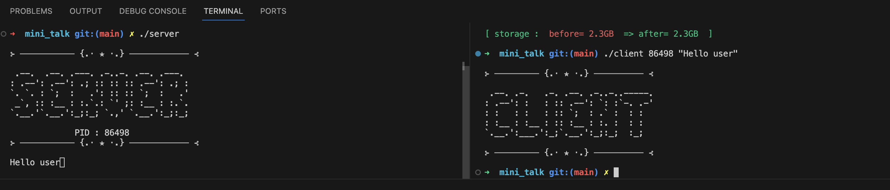

# mini_talk
A small data exchange program in the form of a client and a server using only UNIX signals. The client must send the string passed as a parameter to the server. Once the string has been received by the client , the server must print it pretty quickly. Only two signals are allowed: SIGUSR1 and SIGUSR2.

## How to run the program ?

1. Clone the `mini_talk` repository into the directory where your `minitalk` project is located:

```bash
git clone git@github.com:yasmineww/mini_talk.git
```
2.  Navigate to the `mini_talk` directory, and generate your executables using make :
For mandaroty part :
```bash
make
```
For bonus part :
```bash
make bonus
```
3. Split your work environment into two terminals, one for the server program, and the other for the client :
```bash
./server
```
Copy the pid displayed on the server side and pass it as argument to the client program, along with the message that you want to send :
```bash
./client pid "string to send"
```
<p align="center">

</p>


## What are Signals ?
It's a form of communication between processes. Signals can be defined as a message, an event or an interrupt.  When a process receives a signal, the process will stop what its doing and take some action.
To send a signal to a specific program, you'll need to specify the PID of that program. That can be achieved using the getpid() fuction. Keep in mind that the program's PID will most definitely have a value that's higher than 0. PIDs of 0 and less have are reserved for the system: 

**PID > 0**: PIDs greater than 0 are assigned to user-space processes.

**PID 0**: This PID is reserved for the "swapper" or "scheduler" process, which is the first process created by the kernel during system initialization. This kernel thread manages system-level tasks. It is not associated with any user-space process.

**PID < 0**: represents special process group IDs (PGID), not an actual process. Specifically, the PID **-1** is used to broadcast signals to all processes except for the sender, and PID **-n** refers to process group n.

Make sure to protect your program from PIDs equal or less that 0:
```bash
if (pid <= 0)
		exit(1);
```

## How can users send a signal from one process to another ?

The server will have to decrypt the message sent by the client so that it can be displayed. Alternatively, the client will have to encrypt the message typed from the console so that it can be sent to the server bit by bit. So, the terminal will have to receive a binary representation of the message that you wish to send. We'll need to figure out away to convert the ASCII representation of each character that form the message to binary code, then sending each binary one by one to the server and setting a sleep time between each transmission to avoid signal overlap. 

You can either use bitwise operators to shift each binary and extract them. ALternatively, you can allocate a tab pointer that will store the value of the 8 bits which make up one character. Then send the content of the tab respecting the order of the bits. Check this **[guide](https://www.lambdatest.com/free-online-tools/ascii-to-binary)** to learn how you can manually convert text into binary. 

It is advisable to use signal() syscall at first to handle your incoming SIGUSR signals. This will help you investigate the difference between signal() and sigaction() syscalls, and understand why I chose to particularly use sigaction() for my program. (Spoiler alert for the next paragraph. Make sure to experient a little in your program before continuing reading).

When I initially worked with signal(), I noticed some garbage values being printed on the server side when the client process was interrupted and restarted `(ctrl+c)`. I figured that it was caused because i wasn't reinitializing to 0 the variables that I use to keep track of the bits that my server receive to buffer into one byte and print afterwards. What happened instead is that when the client get interrupted mid-sending, the few bits that got buffered are stored by the bash, and new bits the make up a completely different character are buffered with the previous bits, which eventually led to garbage values being printed. However, when using sigaction() syscall, i could retrieve the client’s pid, and then adding an `if` condition to reinitialize the variables if ever the pid has been changed. Check **[my medium article](https://medium.com/@makhlouf.yasmine1/exploring-inter-process-communication-how-is-data-exchanged-between-processes-using-signals-ab368c05721f)** where I explained in details how the sigaction() syscall works. 

